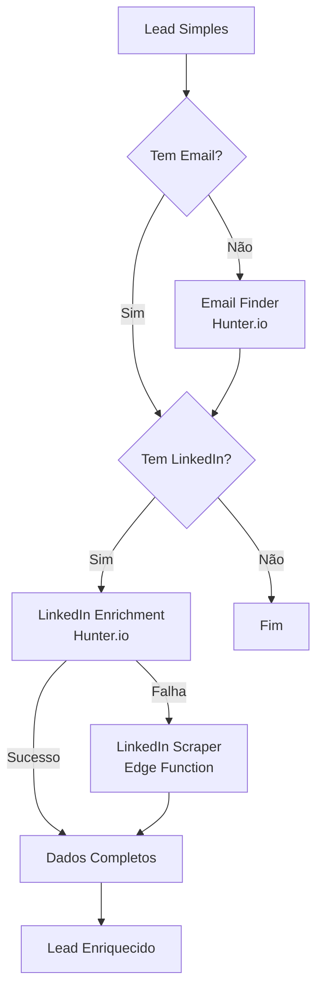

# 🚪 SnapDoor CRM

**CRM Simples e Inteligente - Inspirado no Pipedrive**


Sistema completo de gestão de **negócios e leads** com enriquecimento automático via LinkedIn e Hunter.io. Simples, poderoso e focado em resultados.

---

## ✨ Funcionalidades

### 🎯 Gestão de Leads
- ✅ **Kanban Board** visual com drag-and-drop
- ✅ **Múltiplos Pipelines** personalizáveis
- ✅ **Campos customizados** e tags
- ✅ **Histórico completo** de atividades
- ✅ **Busca global** com Command+K
- ✅ **Filtros avançados** por status, empresa, valor

### 🤖 Enriquecimento Inteligente
- ✅ **3 Camadas de Enriquecimento**:
  1. Email Finder (Hunter.io) - nome + sobrenome + empresa
  2. LinkedIn Handle (Hunter.io) - busca via perfil LinkedIn
  3. LinkedIn Scraper (Edge Function) - fallback com scraping público
- ✅ **Extração Automática**: cargo, empresa, localização, educação, conexões, avatar
- ✅ **Verificação de Emails** (Hunter.io)
- ✅ **Sistema de Créditos** com planos (Essential, Advanced, Professional)

### 📞 Múltiplos Contatos
- ✅ **Vários emails** por lead (Trabalho, Pessoal, etc.)
- ✅ **Vários telefones** por lead (WhatsApp, Celular, Fixo)
- ✅ **Marcação de preferencial** (⭐ apenas 1 por tipo)
- ✅ **Labels personalizadas**

### 💰 Informações Comerciais
- ✅ **Valor do Negócio** editável por lead
- ✅ **Dashboard com métricas reais** (não estimadas)
- ✅ **Receita Total** calculada automaticamente
- ✅ **Taxa de Conversão** precisa

### 📊 Analytics e Relatórios
- ✅ **Dashboard interativo** com gráficos (Recharts)
- ✅ **Métricas em tempo real**: Total de Leads, Taxa de Conversão, Receita, Atividade
- ✅ **Gráficos de tendência** (últimos 7 dias)
- ✅ **Distribuição por etapa** (Bar e Pie charts)
- ✅ **Exportação CSV** completa

### 🔒 Segurança
- ✅ **Row Level Security (RLS)** em todas as tabelas
- ✅ **Autenticação Supabase** (Email + Google OAuth)
- ✅ **Chaves API criptografadas**
- ✅ **HTTPS obrigatório**

---

## 🚀 Início Rápido

### Pré-requisitos

- **Node.js** 18+
- **Conta Supabase** (grátis)
- **Hunter.io API Key** (opcional - para enriquecimento)
- **Stripe** (opcional - para monetização)

### Instalação

```bash
# 1. Clone o repositório
git clone https://github.com/uillenmachado/snapdoor.git
cd snapdoor

# 2. Instale as dependências
npm install

# 3. Configure as variáveis de ambiente
cp .env.example .env
# Edite .env com suas chaves:
# - VITE_SUPABASE_URL
# - VITE_SUPABASE_ANON_KEY
# - VITE_HUNTER_API_KEY (opcional)

# 4. Execute as migrações do banco
npx supabase db push

# 5. Deploy da Edge Function (LinkedIn Scraper)
npx supabase functions deploy linkedin-scraper

# 6. Inicie o servidor de desenvolvimento
npm run dev
```

Acesse: `http://localhost:5173`

---

## 📖 Documentação

Toda a documentação está organizada na pasta [`docs/`](./docs/):

- **[README Completo](./docs/README.md)** - Visão geral e arquitetura
- **[Sistema de Créditos](./docs/CREDIT_SYSTEM_GUIDE.md)** - Como funciona o sistema de créditos
- **[Enriquecimento de Leads](./docs/LEAD_ENRICHMENT_GUIDE.md)** - Guia técnico completo
- **[Guia do Usuário](./docs/USER_ENRICHMENT_GUIDE.md)** - Como usar o enriquecimento
- **[Configuração Supabase](./docs/SUPABASE_SETUP_GUIDE.md)** - Setup completo do backend

---

## 🏗️ Stack Tecnológica

| Categoria | Tecnologia |
|-----------|-----------|
| **Frontend** | React 18, TypeScript, Vite |
| **UI** | TailwindCSS, shadcn/ui, Recharts |
| **Backend** | Supabase (PostgreSQL + Auth + Storage) |
| **Edge Functions** | Deno (LinkedIn Scraper) |
| **Integrações** | Hunter.io, Stripe |
| **Estado** | @tanstack/react-query |
| **Formulários** | React Hook Form |
| **Validação** | Zod |

---

## 📁 Estrutura do Projeto

```
snapdoor/
├── src/
│   ├── components/       # Componentes React reutilizáveis
│   │   ├── ui/          # Componentes shadcn/ui
│   │   ├── EditableField.tsx
│   │   ├── MultipleContacts.tsx
│   │   ├── LeadCard.tsx
│   │   └── ...
│   ├── pages/           # Páginas da aplicação
│   │   ├── Dashboard.tsx
│   │   ├── Leads.tsx
│   │   ├── LeadProfile.tsx
│   │   └── ...
│   ├── hooks/           # Custom hooks
│   │   ├── useLeads.ts
│   │   ├── useEnrichLead.ts
│   │   ├── useCredits.ts
│   │   └── ...
│   ├── services/        # Serviços de integração
│   │   ├── leadEnrichmentService.ts
│   │   ├── hunterClient.ts
│   │   ├── linkedinScraperService.ts
│   │   └── companyService.ts
│   ├── lib/             # Utilitários e helpers
│   └── integrations/    # Configuração Supabase
├── supabase/
│   ├── migrations/      # 15 migrações SQL (schema completo)
│   └── functions/
│       └── linkedin-scraper/  # Edge Function para scraping
├── docs/                # 📚 Documentação completa
├── public/              # Arquivos estáticos
└── .env.example         # Template de variáveis de ambiente
```

---

## 🎨 Screenshots

### Dashboard com Métricas Reais


### Kanban Board


### Perfil do Lead - Campos Editáveis


### Múltiplos Contatos


---

## 🔄 Fluxo de Enriquecimento



---

## 🚧 Roadmap

### v2.1 (Em Desenvolvimento)
- [ ] Automações avançadas com triggers
- [ ] Integração com WhatsApp Business
- [ ] Relatórios exportáveis (PDF, Excel)
- [ ] Gráficos personalizáveis no dashboard

### v3.0 (Planejado)
- [ ] App Mobile (React Native)
- [ ] Integração com Google Calendar
- [ ] Sistema de tarefas e follow-ups
- [ ] AI para scoring de leads

---

## 🤝 Contribuindo

Contribuições são bem-vindas! Por favor:

1. Faça um **fork** do projeto
2. Crie uma **branch** para sua feature (`git checkout -b feature/MinhaFeature`)
3. **Commit** suas mudanças (`git commit -m '✨ Add: Minha feature incrível'`)
4. **Push** para a branch (`git push origin feature/MinhaFeature`)
5. Abra um **Pull Request**

---

## 📝 Licença

Este projeto está sob a licença **MIT**. Veja o arquivo [LICENSE](LICENSE) para mais detalhes.

---

## 🆘 Suporte

- **Issues**: [GitHub Issues](https://github.com/uillenmachado/snapdoor/issues)
- **Documentação**: [docs/README.md](./docs/README.md)
- **Email**: suporte@snapdoor.com

---

## ⭐ Dê uma Estrela!

Se este projeto foi útil para você, considere dar uma ⭐ no GitHub!

---

**Desenvolvido com ❤️ por [Uillen Machado](https://github.com/uillenmachado)**

*SnapDoor CRM - Transformando leads em clientes com inteligência artificial.*
